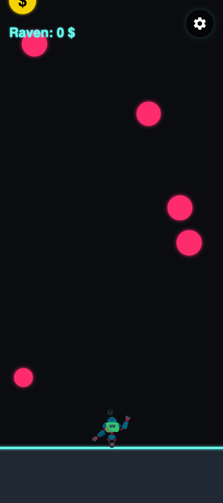
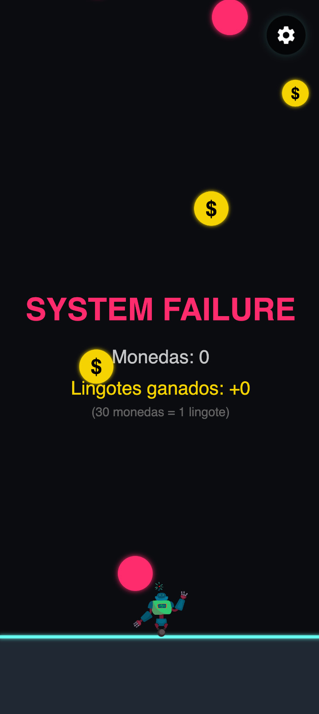
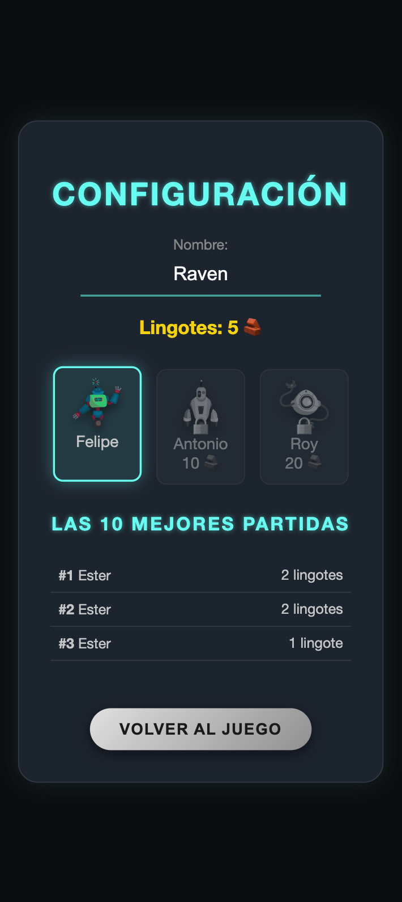

# 🤖 Skip Balls - Cyberpunk Edition

> Un juego arcade de habilidad basado en acelerómetro, desarrollado con tecnologías web modernas y portado a móvil nativo.





## 🎮 Sobre el juego

**Skip Balls** es un juego de supervivencia donde controlas a un robot inclinando tu dispositivo móvil. Tu objetivo es esquivar bolas de lava y recoger monedas para conseguir lingotes y así poder pagar premios.

La estética tiene un estilo **Cyberpunk/Neon**, presentando un fondo oscuro, luces de neón cian y efectos de brillo intenso.

### ✨ Características principales

* **🕹 Control por Movimiento:** Utiliza el giroscopio/acelerómetro del móvil. Inclina el teléfono para mover al personaje.
* **🎨 Estética Neon:** canvas y estilos con efectos de `shadowBlur` para simular luces de neón.
* **💰 Economía de Juego:** * Recoge monedas durante la partida.
    * **30 Monedas = 1 Lingote (🧱)**.
    * Usa lingotes para desbloquear nuevos robots en la tienda.
* **🛒 Tienda de Personajes:** Puedes comprar dos skins más de robot: Anthony y Roy, cada uno con su propio coste.
* **🏆 Sistema de Ranking:** Guarda localmente las 10 mejores puntuaciones.
* **📱 Diseño Responsivo:** Interfaz adaptada a cualquier pantalla móvil, únicamente jugable en vertical.

## 🛠 Tecnologías Utilizadas

Este proyecto utiliza un stack moderno para el desarrollo híbrido:

* **[Vite](https://vitejs.dev/):** Nuevo entorno de desarrollo ultrarrápido y bundler.
* **[p5.js](https://p5js.org/):** Librería principal para el renderizado del Canvas, físicas y lógica del juego.
* **[Capacitor](https://capacitorjs.com/):** Para empaquetar la aplicación web como una app nativa (Android) y acceder a sensores del dispositivo.
* **HTML5 / CSS3:** Diseño de la UI (menús, tienda) con Flexbox y Grid.
* **Local Storage:** Persistencia de datos (monedas, personajes desbloqueados y récords).

## 🚀 Instalación y Desarrollo Local

Se necesita tener instalado [Node.js](https://nodejs.org/) en el ordenador.

1.  **Clonar el repositorio:**
    ```bash
    git clone [https://github.com/elecinas/skip-balls.git](https://github.com/elecinas/skip-balls.git)
    cd skip-balls
    ```

2.  **Instalar dependencias:**
    ```bash
    npm install
    ```

3.  **Ejecutar en modo desarrollo:**
    ```bash
    npm run dev
    ```
    *Nota: Para probar los sensores de movimiento en el navegador de PC, necesitarás abrir la IP local en tu móvil.*

## 📲 Compilar para Android (APK)

Para generar la aplicación nativa usando Capacitor:

1.  **Generar el build de producción:**
    ```bash
    npm run build
    ```

2.  **Añadir la plataforma Android (solo la primera vez):**
    ```bash
    npx cap add android
    ```

3.  **Sincronizar los cambios:**
    ```bash
    npx cap sync
    ```

4.  **Abrir Android Studio:**
    ```bash
    npx cap open android
    ```
    *Desde Android Studio, se puede ejecutar la app en un emulador o en un dispositivo móvil conectado por USB.*

## 🕹 Cómo Jugar

1.  Abrir la aplicación en el móvil.
2.  Aceptar los permisos de movimiento (si se solicitan).
3.  **Inclinar el móvil** a izquierda o derecha para mover al robot.
4.  Esquivar las bolas rojas (💥).
5.  Recoger las bolas doradas (💰).
6.  Si mueres, tus monedas se convertirán en lingotes (cada 30 monedas un lingote), luego se pierden.
7.  Tocar el botón **⚙️ (Engranaje)** para ir a la tienda y gastar los lingotes.

## 📢 Créditos y Atribuciones

* **Ilustraciones de Robots:** [Freepik](https://www.freepik.com)
* **Código y Desarrollo:** Esther Lecina
* **Herramientas de Apoyo:**
    * Este proyecto ha utilizado **IA** como asistente de programación para:
        * Resolución de bugs y depuración.
        * Generación y refinamiento de estilos CSS.