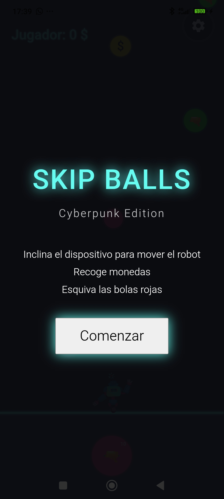
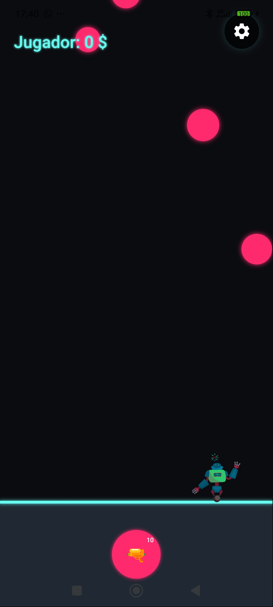
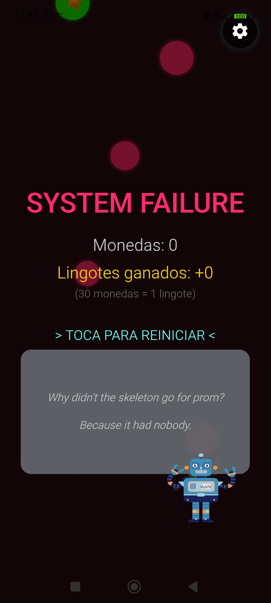
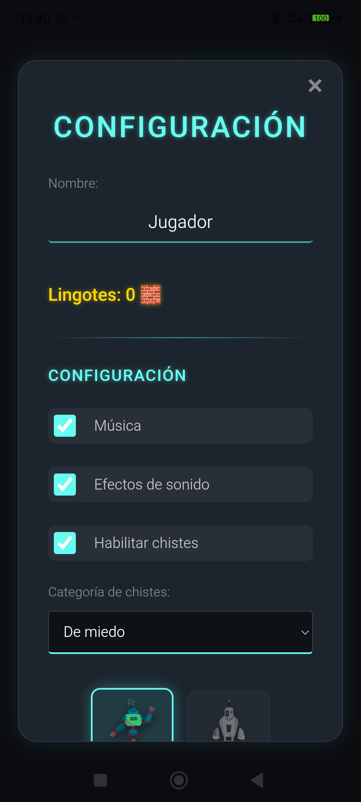
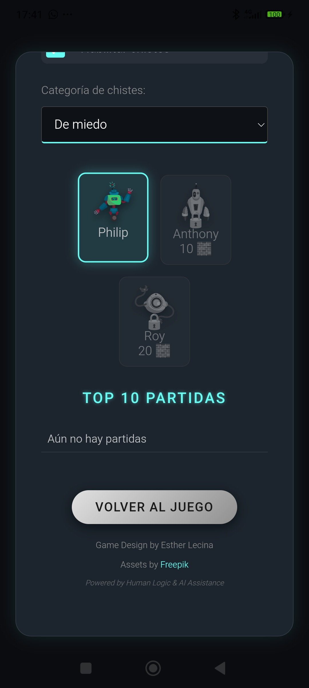

# 🤖 Skip Balls - Cyberpunk Edition

> Un juego arcade de habilidad basado en sensor de orientación, desarrollado con tecnologías web modernas y portado a móvil nativo.

<p align="center">
   
  &nbsp; &nbsp;
  
  &nbsp; &nbsp;
  
  &nbsp; &nbsp;
  
  
  &nbsp; &nbsp;
</p>

## 🎮 Sobre el juego

**Skip Balls** es un juego de supervivencia donde controlas a un robot inclinando tu dispositivo móvil. Tu objetivo es esquivar bolas de lava y recoger monedas para conseguir lingotes y así poder pagar premios.

La estética tiene un estilo **Cyberpunk/Neon**, presentando un fondo oscuro, luces de neón cian y efectos de brillo intenso.

### ✨ Características principales

* **🕹 Control por Movimiento:** Utiliza el sensor de orientación (DeviceOrientation) del móvil. Inclina el teléfono para mover al personaje.
* **🎨 Estética Neon:** canvas y estilos con efectos de `shadowBlur` para simular luces de neón.
* **💰 Economía de Juego:** * Recoge monedas durante la partida.
    * **30 Monedas = 1 Lingote (🧱)**.
    * Usa lingotes para desbloquear nuevos robots en la tienda.
* **🛒 Tienda de Personajes:** Puedes comprar dos skins más de robot: Anthony y Roy, cada uno con su propio coste.
* **🤖 Sistema de Humor (JokeAPI):** El robot tiene personalidad propia.
    * Contará un chiste en la pantalla de *Game Over*.
    * **Categorías configurables:** Elige en ajustes, si quieres leer chistes. Y si, sí quieres, puedes elegir entre chistes de Programación, Terror, Navidad, Juegos de palabras, etc.
    * **Modo Offline:** Incluye un sistema de respaldo local para que el robot nunca se quede callado, incluso sin internet.
* **🏆 Sistema de Ranking:** Guarda localmente las 10 mejores puntuaciones.
* **🔫 Sistema de Combate:** Toca cualquier parte de la pantalla para disparar y destruir enemigos. Empiezas con 10 balas y debes administrar tu munición.
* **📦 Power-ups:** Aparecen cajas de suministros (iconos verdes) que recargan tu arma (+5 balas) y reproducen un sonido de recarga.
* **📳 Feedback Háptico:** El móvil vibra al recibir daño, recoger items o disparar (gracias a Capacitor Haptics).
* **🔊 Audio Reactivo:** Efectos de sonido para disparos, explosiones y monedas, además de música de fondo. Incluye controles para silenciar Música o FX independientemente.
* **📱 Diseño Responsivo:** Interfaz adaptada a cualquier pantalla móvil, únicamente jugable en vertical.

## 🛠 Tecnologías Utilizadas

Este proyecto utiliza un stack moderno para el desarrollo híbrido:

* **[Vite](https://vitejs.dev/):** Nuevo entorno de desarrollo ultrarrápido y bundler.
* **[p5.js](https://p5js.org/):** Librería principal para el renderizado del Canvas, físicas y lógica del juego.
* **[Capacitor](https://capacitorjs.com/):** Para empaquetar la aplicación web como una app nativa (Android) y acceder a sensores del dispositivo.
* * **[JokeAPI](https://jokeapi.dev/):** API REST para obtener contenido dinámico (chistes) mediante `fetch` asíncrono.
* **HTML5 / CSS3:** Diseño de la UI (menús, tienda) con Flexbox y Grid.
* **[Capacitor Preferences](https://capacitorjs.com/docs/apis/preferences):** Persistencia de datos (monedas, personajes desbloqueados y récords).
* **[p5.sound](https://p5js.org/reference/#/libraries/p5.sound):** Extensión de p5.js para la gestión de audio, efectos y música.
* **[@capacitor/haptics](https://capacitorjs.com/docs/apis/haptics):** Plugin para controlar el motor de vibración del dispositivo.
* **[@capacitor/assets](https://capacitorjs.com/docs/guides/splash-screens-and-icons):** Herramienta para la generación automática de iconos y pantallas de carga (Splash Screens) para Android e iOS.

## 🚀 Instalación y Desarrollo Local

Se necesita tener instalado [Node.js](https://nodejs.org/) en el ordenador.

1.  **Clonar el repositorio:**
    ```bash
    git clone [https://github.com/elecinas/skip-balls.git](https://github.com/elecinas/skip-balls.git)
    cd skip-balls
    ```

2.  **Instalar dependencias:**
    ```bash
    npm install
    ```

3.  **Ejecutar en modo desarrollo:**
    ```bash
    npm run dev
    ```
    *Nota: Para probar los sensores de movimiento en el navegador de PC, necesitarás abrir la IP local en tu móvil.*

## 📲 Compilar para Android (APK)

Para generar la aplicación nativa usando Capacitor:

1.  **Generar el build de producción:**
    ```bash
    npm run build
    ```

2.  **Añadir la plataforma Android (solo la primera vez):**
    ```bash
    npx cap add android
    ```

3.  **Sincronizar los cambios:**
    ```bash
    npx cap sync android
    ```

4.  **Abrir Android Studio:**
    ```bash
    npx cap open android
    ```
    *Desde Android Studio, se puede ejecutar la app en un emulador o en un dispositivo móvil conectado por USB.*

## 🕹 Cómo Jugar

1.  Abrir la aplicación en el móvil.
2.  Aceptar los permisos de movimiento (si se solicitan).
3.  **Inclinar el móvil** a izquierda o derecha para mover al robot.
4.  Esquivar las bolas rojas (💥).
5.  Tocar el botón de la pistola para disparar a las bolas rojas y destruirlas.
6.  Recoger las bolas doradas (💰).
7.  Si mueres, tus monedas se convertirán en lingotes (cada 30 monedas un lingote), luego se pierden.
8.  **Leer el chiste:** En la pantalla de *Game Over*, aparecerá un chiste temático como recompensa (si está activado).
9.  Tocar el botón **⚙️ (Engranaje)** para ir a la tienda, gastar los lingotes o **configurar la categoría de los chistes**.

## 📢 Créditos y Atribuciones

* **Ilustraciones de Robots:** [Freepik](https://www.freepik.com)
* * **API de Chistes:** [JokeAPI (Sv443)](https://jokeapi.dev/)
* * **Efectos de Sonido y Música:** Royalty-free music & SFX de [Pixabay](https://pixabay.com/sound-effects/)
* **Código y Desarrollo:** Esther Lecina
* **Herramientas de Apoyo:**
    * Este proyecto ha utilizado **IA** como asistente de programación para:
        * Resolución de bugs y depuración.
        * Generación y refinamiento de estilos CSS.

## 📥 Descargar APK

Puedes descargar la versión Android aquí:

tps://github.com/elecinas/skip-balls/releases/download/v1.0/app-debug.apk


## 📄 Licencia

© 2025 Esther Lecina. Todos los derechos reservados.

Este proyecto se distribuye bajo una **licencia propietaria**.  
El código, la lógica y el diseño no pueden copiarse, modificarse ni redistribuirse sin permiso explícito de la autora.

Los recursos gráficos (robots/personajes) pertenecen a **Freepik** y se utilizan bajo sus condiciones de atribución.

Consulta el archivo [`LICENSE`](./LICENSE) para más información.

